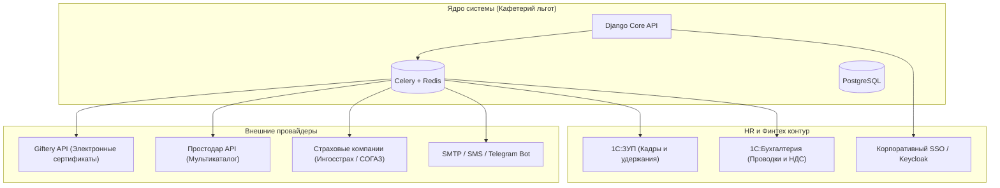

# Архитектура интеграций: «Кафетерий льгот»

> **Разработано TDDaniel** — [Портфолио разработчика](https://tddaniel.netlify.app)  
> Техническая спецификация интеграционных шлюзов, API-адаптеров и протоколов обмена.

---

## 1. Обзор архитектуры интеграционного контура

Интеграционный слой системы построен на паттерне **Adapter / Gateway** с асинхронной очередью задач на базе **Celery + Redis**. Это гарантирует отказоустойчивость: временная недоступность внешних сервисов не блокирует пользовательские интерфейсы и не приводит к потере данных.



---

## 2. Интеграция с 1С:ЗУП (Зарплата и управление персоналом)

### 2.1 Назначение:
1. **Кадровый синхронизатор (Входящий поток)**:
   - Регулярный импорт реестра сотрудников (ФИО, табельный номер, подразделение, должность, грейд, статус занятости, даты отпусков).
   - Автоматическое присвоение ролей: `РОЛ.1` (Сотрудник), `РОЛ.2` (Декрет / Отпуск по уходу за ребенком), `РОЛ.3` (VIP / Топ-менеджмент), либо исключение уволенных (`is_excluded = True`).
2. **Передача удержаний за софинансирование (Исходящий поток)**:
   - Выгрузка реестра доплат сотрудников за выбранные программы ДМС родственников и сверхлимитные заказы.
   - Формирование документа «Удержание за бенефиты» в расчетном листке сотрудника.

### 2.2 Формат обмена:
* **Протокол**: REST API по защищенному каналу mTLS / HTTPS с Basic или Bearer авторизацией.
* **Периодичность**:
  - Кадровый срез: ежедневно в 02:00 ночи (Celery Beat task: `sync_1c_employees`).
  - Реестр удержаний: 25-го числа каждого расчетного месяца в 18:00.
* **Пример полезной нагрузки входящего кадрового события (JSON)**:
```json
{
  "tab_number": "TR-004821",
  "email": "a.morozova@company.ru",
  "first_name": "Анна",
  "last_name": "Морозова",
  "middle_name": "Сергеевна",
  "grade": "L5",
  "department_code": "DEP-TECH-04",
  "status": "ACTIVE",
  "employment_date": "2021-04-12",
  "has_unspent_vacation": true,
  "role_attributes": {
    "is_vip": false,
    "is_maternity": false
  }
}
```

---

## 3. Интеграция с корпоративным SSO (Keycloak / Active Directory / SAML / OIDC)

* **Поддерживаемые протоколы**: OpenID Connect (OIDC) и SAML 2.0.
* **User Mapping**:
  - `sub` / `UPN` -> уникальный внешний идентификатор сотрудника.
  - `email` -> рабочий адрес электронной почты.
  - `groups` / `roles` -> автоматический маппинг в группы прав `HR_ADMIN`, `SYSTEM_ADMIN`, `EMPLOYEE`.
* **Аутентификация в API**:
  - JWT Access Token (Bearer) проверяется бэкендом с валидацией JWKS публичного ключа провайдера identity.
  - Для локальной и стендовой разработки предусмотрен `TokenAndSessionAuthentication` с генерацией отладочных сессионных токенов.

---

## 4. Шлюзы агрегаторов сертификатов (Giftery & Prostodar)

В системе реализован отказоустойчивый интерфейс `IVoucherProviderGateway`:

```python
class IVoucherProviderGateway(ABC):
    @abstractmethod
    def issue_voucher(self, partner_sku: str, nominal: Decimal, recipient_email: str) -> IssuedVoucherDTO:
        """Эмиссия сертификата через внешний шлюз"""
        pass

    @abstractmethod
    def check_voucher_status(self, external_id: str) -> VoucherStatusDTO:
        """Проверка статуса активации"""
        pass
```

### 4.1 Реализация для Giftery API:
* **Эндпоинты**:
  - `POST /api/v1/orders` — создание заказа на сертификат.
  - `GET /api/v1/orders/{order_id}` — опрос статуса готовности сертификата.
* **Fallback & Mock Режим**:
  - Если переменная `GIFTERY_MOCK_MODE=True` или внешний сервер отвечает `5xx`, система активирует встроенный мок-генератор безопасных криптостойких промокодов `MOCK-GIFTERY-XXXX-YYYY` с валидным QR-хешем. Это позволяет проводить тестирование и непрерывную эксплуатацию даже при сбоях агрегатора.

### 4.2 Безопасность и защита от повторной активации (Идемпотентность):
* Каждый запрос на выпуск сертификата снабжается уникальным `idempotency_key = sha256(order_id + item_id + attempt)`.
* Внешний шлюз проверяет ключ и гарантирует, что средства не спишутся повторно при сетевых таймаутах.

---

## 5. Интеграция со страховыми компаниями (ДМС: Ингосстрах, СОГАЗ, РЕСО)

* **Реестровый обмен (Registry Batching)**:
  - По окончании «Окна выбора» система автоматически группирует согласованные заявки на ДМС по филиалам, уровням франшизы и прикрепленным родственникам.
  - Генерируется стандартизированный структурированный XML / Excel файл по форме страховщика:
    - ФИО сотрудника / родственника, СНИЛС, паспортные данные, программа, клиники, опция стоматологии.
* **Статус полиса**:
  - Ответ страховщика с присвоенными номерами электронных полисов импортируется через админ-панель (АДМ-11) либо через SFTP-шлюз.

---

## 6. Экспорт в 1С:Бухгалтерия (ФТ-АНЛ.6, АДМ-22)

Система генерирует финансовую и бухгалтерскую отчетность с расчетом налогооблагаемой базы:
1. **Проводки по счетам РСБУ**:
   - Дт 73.03 (Расчеты по прочим операциям) — Кт 76.09 (Расчеты с поставщиками льгот).
   - Дт 70 (Оплата труда) — Кт 73.03 (Удержание софинансирования из зарплаты сотрудника).
   - Выделение НДС 20% по операциям, подлежащим налогообложению согласно ст. 149, 171 НК РФ.
2. **Форматы выгрузки**:
   - `XLSX` (с формулами и группировками).
   - `CSV` (UTF-8 with BOM для автоматической загрузки в конфигурации 1С).
   - `JSON` через REST эндпоинт `/api/reports/accounting-export/`.

---

## 7. Каналы коммуникаций и уведомлений (Comms Gateway)

Модуль коммуникаций (`backend/apps/comms/`) поддерживает мультиканальную рассылку:
1. **Email (SMTP)**:
   - Шаблоны HTML: открытие окна выбора, предупреждение об истечении баллов за 14 и 3 дня, квитанция заказа, выдача промокода.
2. **Push-уведомления (Web Push)**:
   - Мгновенные оповещения в браузере об ответе поддержки и поступлении баллов от коллеги.
3. **Telegram Bot**:
   - Привязка Telegram ID сотрудника для получения статусных уведомлений и двухфакторных кодов.

---

*Разработано разработчиком TDDaniel — https://tddaniel.netlify.app*
